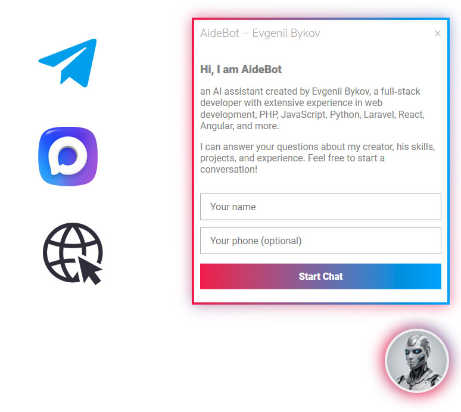

# AideBot

AideBot is a multi‑platform AI assistant that mimics a specific persona. It currently supports **Telegram**, **MAX** messengers, and a **web widget** (embeddable chat). It uses **GigaChat** as the LLM backend and stores conversation history locally.

## Features

- Responds as a digital twin of the defined persona (from `persona.txt`).
- Owner‑only commands (`/summary`, `/restart`, etc.).
- Conversation context (last 5 messages) preserved across restarts.
- Rate limiting (10 messages per minute per user).
- Caching of repeated questions to save API calls.
- Internationalization ready (supports English and Russian; can be extended).
- **Web widget** – embeddable chat interface for your website.
- Configurable file logging (`LOG_TO_FILE`).

## Project Structure

```
.
├── config.py                # Configuration (tokens, user IDs, flags)
├── flush_max.py             # Utility to flush pending MAX messages
├── INSTALL.md               # VPS deployment guide
├── LICENSE.txt              # GPLv3 license
├── locales/                 # Translation files
│   ├── en.json
│   └── ru.json
├── main.py                  # Entry point
├── persona.txt              # Persona description
├── README.md                # Read me file
├── requirements.txt         # Python dependencies
├── run.bat                  # Windows launcher
├── run.sh                   # Linux/macOS launcher
├── src/                     # Source modules
│   ├── base_handler.py      # Abstract messenger handler
│   ├── cache.py             # Simple TTL cache
│   ├── context.py           # Conversation history management
│   ├── dispatcher.py        # Command and message router
│   ├── i18n.py              # Internationalization helper
│   ├── llm.py               # LLM abstraction layer (GigaChat)
│   ├── max_handler.py       # MAX messenger implementation
│   ├── notifier.py          # New‑user notifications
│   ├── prompts.py           # Prompt templates (Russian)
│   ├── public_chat.py       # Public user logic (persona + context)
│   ├── storage.py           # Chat log persistence
│   ├── telegram_handler.py  # Telegram implementation
│   ├── utils.py             # Utilities (validation, rate limit, etc.)
│   └── web_handler.py       # Web widget backend (Flask)
└── web_widget/              # Frontend widget files
    ├── aidebot-widget.js
    ├── avatar.png
    ├── evbkv.html
    └── start-server.bat
```

## Prerequisites

- Python 3.8 or higher
- A GigaChat API key (get it from [Sberbank](https://developers.sber.ru/portal/products/gigachat))
- Telegram bot token (from [@BotFather](https://t.me/BotFather)) – optional
- MAX bot token and API base URL – optional
- A web server (if you want to host the widget) – optional

## Installation

1. Clone the repository:
   ```bash
   git clone https://github.com/evbkv/aidebot.git
   cd aidebot
   ```

2. Create a virtual environment (recommended):
   ```bash
   python -m venv venv
   source venv/bin/activate   # Linux/macOS
   venv\Scripts\activate      # Windows
   ```

3. Install dependencies:
   ```bash
   pip install -r requirements.txt
   ```

4. Configure the bot:
   - Edit `config.py` and fill in your tokens, user IDs, and enable/disable messengers.
   - Modify `persona.txt` to describe the persona you want the bot to imitate.
   - Set `WEB_ENABLED = True` if you plan to use the web widget.

5. (Optional) Add more languages:
   - Create a new JSON file in `locales/` (e.g., `de.json`) with the same keys as `en.json`.
   - The bot will use the user’s language code from Telegram (falls back to `ru`).

## Running the Bot

### Windows
Double‑click `run.bat` or execute in terminal:
```
run.bat
```

### Linux / macOS
Make the script executable and run:
```bash
chmod +x run.sh
./run.sh
```

The bot starts:
- Web widget server on `http://0.0.0.0:5000` (if enabled).
- MAX polling in a background thread (auto‑restart on crash).
- Telegram polling in the main thread (if enabled, otherwise a waiting loop).

## Commands

| Command | Owner only? | Description |
|---------|-------------|-------------|
| `/start` | No | Greeting message |
| `/help`  | No | Help text |
| `/id`    | Yes | Show your user ID |
| `/summary <messenger> <user_id>` | Yes | Generate a summary of the conversation with the given user |
| `/restart` | Yes | Restart the bot (Telegram only) |

## Web Widget

To embed the chat widget on your website:

1. Copy `web_widget/aidebot-widget.js` and `web_widget/avatar.png` to your web server.
2. Add the following HTML snippet to your page:
   ```html
   <script src="/path/to/aidebot-widget.js"
           data-api-base="https://your-domain.com/api"
           data-auto-open-delay="5000"
           data-health-check-interval="30000"></script>
   ```
3. Configure CORS origins in `config.py` (add your website domain to `WEB_ALLOWED_ORIGINS`).
4. See `INSTALL.md` for a complete deployment guide (reverse proxy, SSL, systemd).

## Adding a New Messenger

1. Create a new handler class in `src/` that inherits from `base_handler.MessengerHandler`.
2. Implement `send_message`, `get_user_language`, and `run_polling`.
3. In `main.py`, instantiate the handler when the corresponding config flag is enabled.

## Switching to Another LLM

1. Create a new provider class in `src/llm.py` inheriting from `LLMProvider`.
2. Implement the `ask` method (and optionally `summarize`).
3. Add a branch in the factory function `get_provider()`.
4. Set `LLM_PROVIDER` in `config.py` to the new provider’s name.

## Future enhancements for commercial deployment

The current version is suitable for personal use and small‑scale projects. For commercial deployment, the following improvements are recommended:

- **Environment variables for secrets** – Move all tokens and credentials from `config.py` to environment variables (e.g., using a `.env` file) to avoid exposing them in the codebase.
- **Automated tests** – Add unit and integration tests using `pytest` to ensure reliability and ease maintenance.
- **Containerization** – Provide a `Dockerfile` and `docker-compose.yml` for easy deployment and scaling.
- **Monitoring and logging** – Integrate with tools like Prometheus/Grafana or the ELK stack to track performance, errors, and usage metrics.

These enhancements would make the bot production‑ready for higher loads and team environments.

## Screenshot



## Author

[Evgenii Bykov](https://github.com/evbkv)

## License

This project is licensed under the GNU General Public License v3.0 – see the [LICENSE](LICENSE.txt) file for details.

## Acknowledgements

- [python-telegram-bot](https://github.com/python-telegram-bot/python-telegram-bot)
- [GigaChat Python SDK](https://pypi.org/project/gigachat/)
- [Flask](https://flask.palletsprojects.com/)